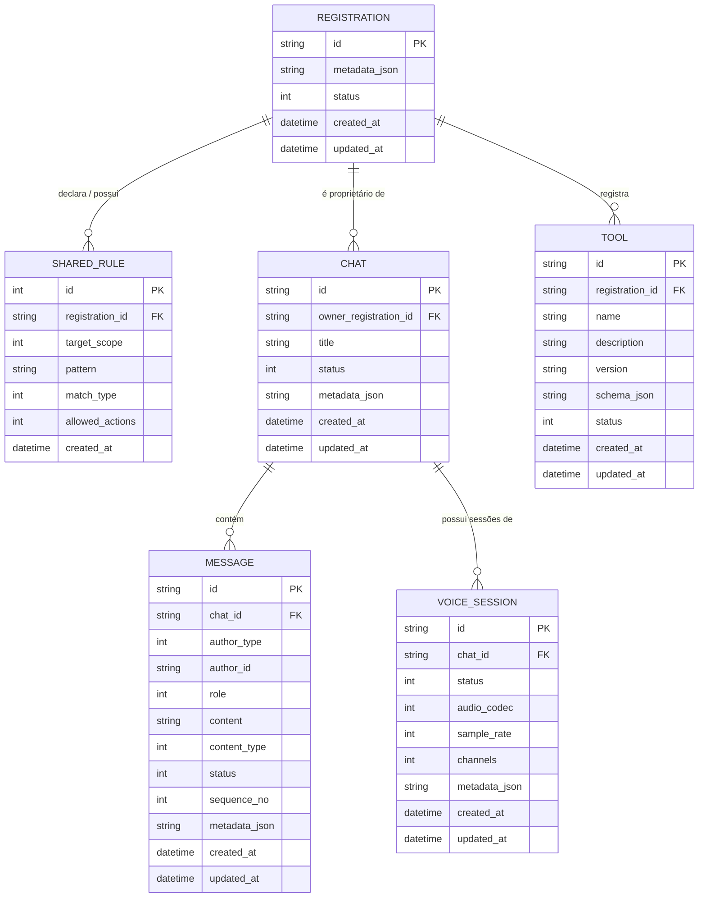
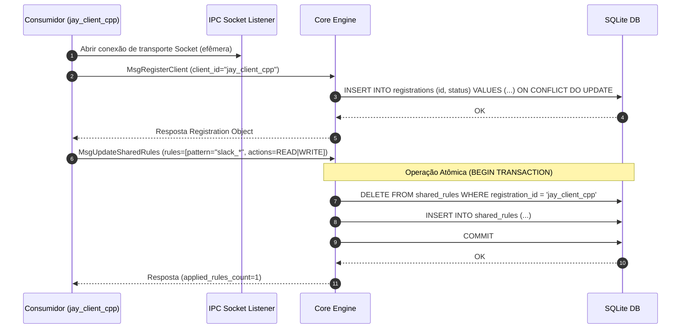
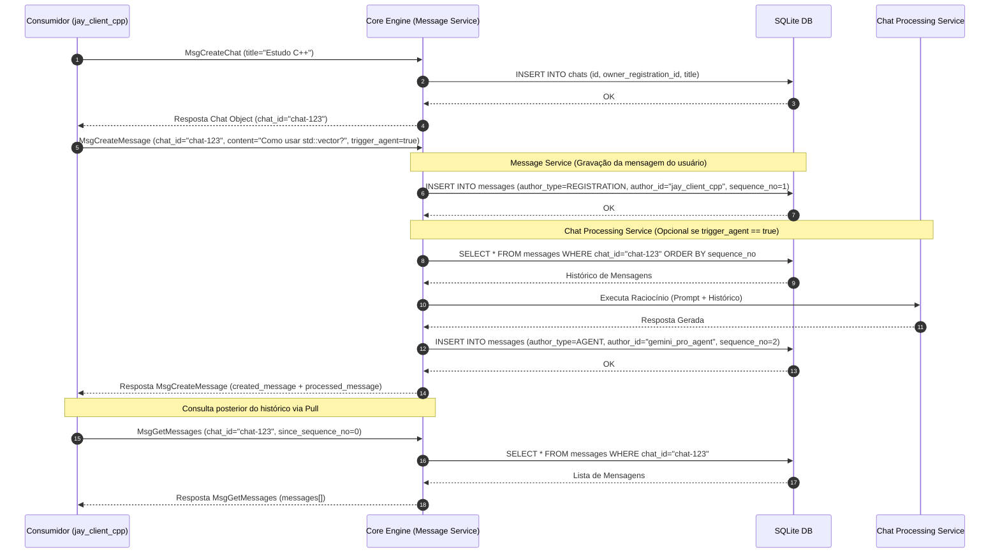
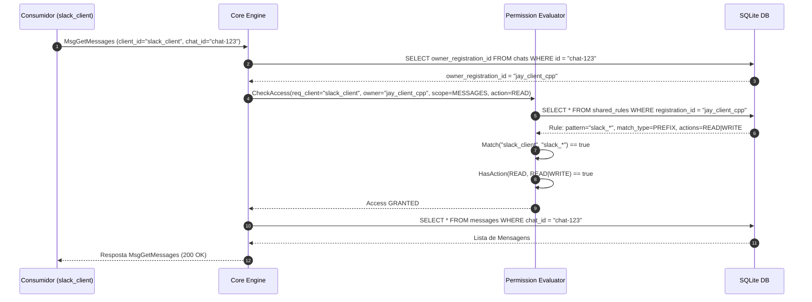

# PRD: Evolução Arquitetural do Jay Core — Serviço Orientado a Recursos com Persistência SQLite e Comunicação Estritamente Reativa (Pull-Only)

**Documento:** Specification & Architecture PRD  
**Status:** Aprovado / Especificação Oficial  
**Autor:** Equipe de Arquitetura Jay  
**Escopo:** `jay-ia/core` (Backend Go Core, Protocolo IPC/RPC e Camada de Persistência SQLite)

---

## 1. Visão Geral e Objetivos Arquiteturais

### 1.1. Contexto e Motivação
Atualmente, o **Jay Core** mantém parte substancial de seu estado em estruturas de memória (*in-memory maps/slices*), o que limita a resiliência do sistema, dificulta a concorrência entre múltiplos clientes, impede reinicializações transparentes da aplicação e dificulta a evolução para um modelo multi-consumidor (CLI, Desktop C++, Web, Slack, Discord, etc.).

Esta evolução arquitetural tem como objetivo transformar o **Jay Core** em um **Serviço Orientado a Recursos (*Resource-Oriented Service*)** completamente desacoplado das aplicações cliente, com estado 100% persistido em um banco de dados **SQLite** embarcado.

### 1.2. Decisão Arquitetural Fundamental: Comunicação Estritamente Reativa (Pull-Only)

> [!CAUTION]
> **REGRA IMPERATIVA DO CORE:**
> **O Core NUNCA envia mensagens espontâneas ou não solicitadas.**
> Não existirão mecanismos de *push*, *broadcast*, notificações automáticas de mudança de estado ou assinaturas ativas (*pub/sub*) emitidas pelo Core. Toda e qualquer comunicação é **sempre iniciada pelo Cliente** no modelo Requisição-Resposta (*Request-Response / Pull*).

```
+--------------------+                   +-------------------+
| Consumidor (Pull)  | -- Solicitacao -> |     Jay Core      |
| (Ex: jay_client)   | <- Resposta ----- | (Resource Engine) |
+--------------------+                   +-------------------+
```

#### Por que esta decisão foi tomada?
1. **Determinismo e Simplicidade Operacional**: Elimina condições de corrida complexas (*race conditions*), problemas de ordenação de eventos em conexões concorrentes e necessidade de manter estado de sessão de entrega por cliente.
2. **Resiliência do Protocolo**: Se um consumidor desconecta, reinicia ou oscila a rede, ele não perde eventos "push" que foram emitidos na sua ausência. Ao reconectar ou a qualquer momento, o consumidor simplesmente consulta o estado do recurso (`GetMessages`, `GetChats`, `ListTools`).
3. **Desacoplamento Absoluto de Aplicação**: O Core não precisa gerenciar listas de assinantes por tópico ou manter loops de dispatch ativos para consumidores lentos (*slow consumers*).

---

## 2. Princípios de Design do Sistema

### 2.1. Identidades Lógicas Registradas (App-Agnostic & Transport-Decoupled)
- A entidade `Registration` representa uma **identidade lógica conhecida pelo Core** (ex: `jay_client_cpp`, `jay_client_cli`, `slack_client`), e **NÃO** um socket ou transporte físico conectado.
- **Desacoplamento de Transporte**: Conexões físicas (Sockets IPC / Unix Domain Socket / TCP) são efêmeras. O transporte pode abrir e fechar livremente sem afetar a existência da identidade lógica `Registration` persistida no SQLite.
- **O Core não conhece domínios de aplicação ("O Core não sabe quem é ninguém")**: O Core não interpreta nem possui *hardcoding* para "Slack", "Discord" ou "Jay". Para o Core, todos são apenas identificadores lógicos registrados (`Registration`).
- **Responsabilidade do Identificador**: O `id` de registro é uma chave de busca e escopo para avaliação de regras de compartilhamento. O Core não realiza autenticação de identidade ou gestão de segredos. Quem fornece a chave é responsável por ela.

### 2.2. Desacoplamento entre Message Service e Chat Processing Service
- O CRUD de mensagens é mantido pelo **Message Service**, responsável estritamente pela persistência, listagem e manutenção da ordem cronológica de mensagens (permitindo importação de histórico, sincronização de conversas e injeção de mensagens de sistema sem acionamento de IA).
- O processamento de linguagem/resposta da conversa é mantido pelo **Chat Processing Service** (`MsgProcessChat`), executado de forma desacoplada ou solicitado opcionalmente via flag (`trigger_agent = true`) ou comando de processamento dedicado.

### 2.3. Modelo de Permissões e Compartilhamento Flexível (`SharedRule`)
- Cada registro pode declarar regras de propriedade (*owners*) e regras de compartilhamento (*shared_from* / *permission_rules*).
- O Core apenas executa o *matching* declarativo das regras sobre os identificadores dos consumidores, sem entender a semântica da aplicação.

### 2.4. Tipificação Estrita via Enums
- Todo o protocolo e esquema de domínio utiliza **Enums** numéricos/textuais bem definidos em vez de strings livres para tipificar ações, status, autoria de mensagens, modos de casamento (*match types*) e tipos de conteúdo, minimizando erros e otimizando o parse binário/JSON.

### 2.5. Persistência SQLite Única e Portável
- Eliminação completa de vetores e mapas em memória para estado da aplicação.
- SQLite utilizado no modo **WAL (Write-Ahead Logging)** com chaves estrangeiras ativas e transações ACID.

---

## 3. Modelo de Domínio e Estudo de Entidades

O modelo de domínio é composto por 6 entidades primárias. O design inclui suporte nativo e preparado para **Sessões de Voz (`VoiceSession`)**, embora o processamento de áudio em si esteja fora do escopo imediato.



### 3.1. Detalhamento das Entidades

#### A. `Registration` (Identidade Lógica Registrada)
Representa um consumidor de serviço ou aplicação conhecida no ecossistema Core.
- `id` (String, PK): Identificador único da identidade lógica (ex: `"jay_client_cpp"`).
- `metadata_json` (String JSON): Informações adicionais do consumidor (versão, SO, capacidades).
- `status` (Enum `RegistrationStatus`): Status do registro (`ACTIVE`, `INACTIVE`, `SUSPENDED`).
- `created_at`, `updated_at` (DateTime ISO-8601).

#### B. `SharedRule` (Regra de Compartilhamento e Permissão)
Define quais outros registros têm acesso a recursos pertencentes a um determinado registro.
- `id` (Integer, PK AutoIncrement).
- `registration_id` (String, FK -> `Registration.id`): O registro proprietário da regra.
- `target_scope` (Enum `RuleScope`): Escopo afetado (`ALL`, `CHATS`, `MESSAGES`, `TOOLS`).
- `pattern` (String): Padrão de casamento de ID do consumidor solicitante (ex: `"slack_*"` ou `"jay_client_web"`).
- `match_type` (Enum `MatchType`): Algoritmo de casamento (`EXACT`, `PREFIX`, `WILDCARD`, `REGEX`).
- `allowed_actions` (Enum Bitmask `PermissionAction`): Ações permitidas (`READ`, `WRITE`, `EXECUTE`, `ADMIN`).
- `created_at` (DateTime).

#### C. `Chat` (Conversa)
Container de mensagens mantido pelo Core.
- `id` (String UUID, PK).
- `owner_registration_id` (String, FK -> `Registration.id`): Identidade lógica criadora/proprietária do chat.
- `title` (String): Título do chat.
- `status` (Enum `ChatStatus`): (`ACTIVE`, `ARCHIVED`, `DELETED`).
- `metadata_json` (String JSON).
- `created_at`, `updated_at` (DateTime).

#### D. `Message` (Mensagem e Autoria Composta)
Unidade de interação textual ou estruturada em um Chat.
- `id` (String UUID, PK).
- `chat_id` (String UUID, FK -> `Chat.id`).
- `author_type` (Enum `AuthorType`): Tipo da entidade autora (`REGISTRATION`, `AGENT`, `TOOL`, `SYSTEM`).
- `author_id` (String): Identificador específico do autor (ex: `"jay_client_cpp"`, `"gemini_pro_agent"`, `"web_search"`, `"system"`). Isso elimina a necessidade de registrar o próprio Core como um cliente.
- `role` (Enum `MessageRole`): (`USER`, `ASSISTANT`, `SYSTEM`, `TOOL`).
- `content` (String): Conteúdo textual ou estruturado da mensagem.
- `content_type` (Enum `MessageContentType`): (`TEXT_PLAIN`, `MARKDOWN`, `JSON`, `TOOL_CALL`, `TOOL_RESULT`).
- `status` (Enum `MessageStatus`): (`SENT`, `EDITED`, `DELETED`).
- `sequence_no` (Integer): Sequencial numérico da mensagem no chat para ordenação estrita.
- `metadata_json` (String JSON).
- `created_at`, `updated_at` (DateTime).

> [!NOTE]
> **Edição de Mensagens e Redisparo de Processamento (Evolução Futura):**
> Quando uma mensagem for editada via `UpdateMessage`, seu registro no banco será atualizado para o status `EDITED`. Em iterações futuras, uma edição de mensagem poderá disparar o re-processamento da conversa (`MsgProcessChat`) a partir do histórico atualizado até aquele ponto.

#### E. `Tool` (Ferramenta / Capacidade Registrada e Versionada)
Capacidade funcional registrada por um consumidor para ser utilizada pelo Agente/Core.
- `id` (String UUID / Slug, PK): Identificador único da ferramenta (ex: `"web_search"`).
- `registration_id` (String, FK -> `Registration.id`): Registro do consumidor que oferece a ferramenta.
- `name` (String): Nome legível da ferramenta.
- `description` (String): Descrição de propósito para o Agente.
- `version` (String, default `"1.0.0"`): Versão SemVer da ferramenta para facilitar evolução e compatibilidade.
- `schema_json` (String JSON): Schema JSON dos parâmetros aceitos pela ferramenta.
- `status` (Enum `ToolStatus`): (`AVAILABLE`, `DISABLED`, `DEPRECATED`).
- `created_at`, `updated_at` (DateTime).

#### F. `VoiceSession` (Sessão de Voz — Preparação)
Entidade preparada para gerenciar sessões de áudio bidirecionais vinculadas a chats em versões futuras.
- `id` (String UUID, PK).
- `chat_id` (String UUID, FK -> `Chat.id`).
- `status` (Enum `VoiceSessionStatus`): (`INITIALIZING`, `ACTIVE`, `PAUSED`, `CLOSED`).
- `audio_codec` (Enum `AudioCodec`): (`PCM_16BIT`, `OPUS`, `AAC`).
- `sample_rate` (Integer): Ex: 16000, 24000, 48000.
- `channels` (Integer): Ex: 1 (mono), 2 (stereo).
- `metadata_json` (String JSON).
- `created_at`, `updated_at` (DateTime).

---

## 4. Modelo de Permissões e Regras de Compartilhamento

O motor de permissões do Core avalia o acesso a qualquer recurso (`Chat`, `Message`, `Tool`) com base nas seguintes etapas:

```
[Solicitação do Consumidor R_req para Recurso do Proprietário R_owner]
                         │
                         ▼
             R_req == R_owner ? ── Sim ──> [PERMITIDO (Acesso Total / Owner)]
                         │
                        Não
                         ▼
        Buscar SharedRules ativas de R_owner
                         │
                         ▼
          Filtra por Scope do Recurso
                         │
                         ▼
    Para cada Regra: Avalia Pattern via MatchType
                         │
                         ▼
             Houve Match do Pattern? ── Não ──> Próxima Regra
                         │
                        Sim
                         ▼
        Ação solicitada em ActionBitmask?
            ├── Sim  ──> [PERMITIDO]
            └── Não  ──> [NEGADO]
```

### 4.1. Tipos de Casamento (`MatchType` Enum)
1. `EXACT (1)`: Casamento exato de strings (ex: `pattern = "jay_client_cli"`).
2. `PREFIX (2)`: Casamento por prefixo (ex: `pattern = "jay_*"` combina com `jay_client_cpp`, `jay_client_web`).
3. `WILDCARD (3)`: Suporte a globbing simples (`*` e `?`).
4. `REGEX (4)`: Expressão regular completa em Go `regexp` (ex: `pattern = "^(slack|discord)_client_[0-9]+$"`).

### 4.2. Máscara de Ações (`PermissionAction` Bitmask Enum)
- `READ (1)`: Permite requisições de consulta (`GetChat`, `ListMessages`, `ListTools`).
- `WRITE (2)`: Permite criação e atualização (`CreateMessage`, `UpdateMessage`, `CreateChat`).
- `EXECUTE (4)`: Permite invocação de ferramentas ou execução de agentes em nome do recurso.
- `ADMIN (8)`: Permite alterar regras ou deletar recursos.
- `ALL (15)`: Soma de todas as permissões (`READ | WRITE | EXECUTE | ADMIN`).

---

## 5. Esquema de Banco de Dados (SQLite DDL), Transações e Exclusão

O SQLite será executado com as seguintes pragmas obrigatórias inicializadas na abertura da conexão:
```sql
PRAGMA journal_mode = WAL;
PRAGMA foreign_keys = ON;
PRAGMA busy_timeout = 5000;
PRAGMA synchronous = NORMAL;
PRAGMA user_version = 1; -- Versão do Esquema do Banco
```

### 5.1. DDL Completo das Tabelas

```sql
-- 1. Tabela de Registros de Identidades Lógicas
CREATE TABLE IF NOT EXISTS registrations (
    id TEXT PRIMARY KEY NOT NULL,
    metadata_json TEXT NOT NULL DEFAULT '{}',
    status INTEGER NOT NULL DEFAULT 1, -- 1: ACTIVE, 2: INACTIVE, 3: SUSPENDED
    created_at TEXT NOT NULL DEFAULT (strftime('%Y-%m-%dT%H:%M:%SZ', 'now')),
    updated_at TEXT NOT NULL DEFAULT (strftime('%Y-%m-%dT%H:%M:%SZ', 'now'))
);

-- 2. Tabela de Regras de Compartilhamento
CREATE TABLE IF NOT EXISTS shared_rules (
    id INTEGER PRIMARY KEY AUTOINCREMENT,
    registration_id TEXT NOT NULL,
    target_scope INTEGER NOT NULL DEFAULT 0, -- 0: ALL, 1: CHATS, 2: MESSAGES, 3: TOOLS
    pattern TEXT NOT NULL,
    match_type INTEGER NOT NULL DEFAULT 1,   -- 1: EXACT, 2: PREFIX, 3: WILDCARD, 4: REGEX
    allowed_actions INTEGER NOT NULL DEFAULT 1, -- Bitmask: 1=READ, 2=WRITE, 4=EXECUTE, 8=ADMIN
    created_at TEXT NOT NULL DEFAULT (strftime('%Y-%m-%dT%H:%M:%SZ', 'now')),
    FOREIGN KEY (registration_id) REFERENCES registrations(id) ON DELETE CASCADE
);

-- 3. Tabela de Chats
CREATE TABLE IF NOT EXISTS chats (
    id TEXT PRIMARY KEY NOT NULL,
    owner_registration_id TEXT NOT NULL,
    title TEXT NOT NULL,
    status INTEGER NOT NULL DEFAULT 1, -- 1: ACTIVE, 2: ARCHIVED, 3: DELETED
    metadata_json TEXT NOT NULL DEFAULT '{}',
    created_at TEXT NOT NULL DEFAULT (strftime('%Y-%m-%dT%H:%M:%SZ', 'now')),
    updated_at TEXT NOT NULL DEFAULT (strftime('%Y-%m-%dT%H:%M:%SZ', 'now')),
    FOREIGN KEY (owner_registration_id) REFERENCES registrations(id) ON DELETE RESTRICT
);

-- 4. Tabela de Mensagens (Autoria Composta)
CREATE TABLE IF NOT EXISTS messages (
    id TEXT PRIMARY KEY NOT NULL,
    chat_id TEXT NOT NULL,
    author_type INTEGER NOT NULL DEFAULT 1, -- 1: REGISTRATION, 2: AGENT, 3: TOOL, 4: SYSTEM
    author_id TEXT NOT NULL,
    role INTEGER NOT NULL, -- 1: USER, 2: ASSISTANT, 3: SYSTEM, 4: TOOL
    content TEXT NOT NULL,
    content_type INTEGER NOT NULL DEFAULT 1, -- 1: TEXT_PLAIN, 2: MARKDOWN, 3: JSON, 4: TOOL_CALL, 5: TOOL_RESULT
    status INTEGER NOT NULL DEFAULT 1, -- 1: SENT, 2: EDITED, 3: DELETED
    sequence_no INTEGER NOT NULL,
    metadata_json TEXT NOT NULL DEFAULT '{}',
    created_at TEXT NOT NULL DEFAULT (strftime('%Y-%m-%dT%H:%M:%SZ', 'now')),
    updated_at TEXT NOT NULL DEFAULT (strftime('%Y-%m-%dT%H:%M:%SZ', 'now')),
    FOREIGN KEY (chat_id) REFERENCES chats(id) ON DELETE CASCADE
);

-- 5. Tabela de Ferramentas Registradas e Versionadas
CREATE TABLE IF NOT EXISTS tools (
    id TEXT PRIMARY KEY NOT NULL,
    registration_id TEXT NOT NULL,
    name TEXT NOT NULL,
    description TEXT NOT NULL,
    version TEXT NOT NULL DEFAULT '1.0.0',
    schema_json TEXT NOT NULL DEFAULT '{}',
    status INTEGER NOT NULL DEFAULT 1, -- 1: AVAILABLE, 2: DISABLED, 3: DEPRECATED
    created_at TEXT NOT NULL DEFAULT (strftime('%Y-%m-%dT%H:%M:%SZ', 'now')),
    updated_at TEXT NOT NULL DEFAULT (strftime('%Y-%m-%dT%H:%M:%SZ', 'now')),
    FOREIGN KEY (registration_id) REFERENCES registrations(id) ON DELETE CASCADE
);

-- 6. Tabela de Sessões de Voz (Preparação)
CREATE TABLE IF NOT EXISTS voice_sessions (
    id TEXT PRIMARY KEY NOT NULL,
    chat_id TEXT NOT NULL,
    status INTEGER NOT NULL DEFAULT 1, -- 1: INITIALIZING, 2: ACTIVE, 3: PAUSED, 4: CLOSED
    audio_codec INTEGER NOT NULL DEFAULT 1, -- 1: PCM_16BIT, 2: OPUS, 3: AAC
    sample_rate INTEGER NOT NULL DEFAULT 16000,
    channels INTEGER NOT NULL DEFAULT 1,
    metadata_json TEXT NOT NULL DEFAULT '{}',
    created_at TEXT NOT NULL DEFAULT (strftime('%Y-%m-%dT%H:%M:%SZ', 'now')),
    updated_at TEXT NOT NULL DEFAULT (strftime('%Y-%m-%dT%H:%M:%SZ', 'now')),
    FOREIGN KEY (chat_id) REFERENCES chats(id) ON DELETE CASCADE
);

-- Índices de Alta Performance para Consultas Frequentes
CREATE INDEX IF NOT EXISTS idx_shared_rules_reg ON shared_rules(registration_id);
CREATE INDEX IF NOT EXISTS idx_chats_owner ON chats(owner_registration_id);
CREATE INDEX IF NOT EXISTS idx_messages_chat_seq ON messages(chat_id, sequence_no ASC);
CREATE INDEX IF NOT EXISTS idx_tools_reg ON tools(registration_id);
CREATE INDEX IF NOT EXISTS idx_voice_sessions_chat ON voice_sessions(chat_id);
```

---

### 5.2. Operações Atômicas e Garantias Transacionais (ACID)

As seguintes operações do Core devem ser executadas obrigatoriamente sob transações explícitas do SQLite (`BEGIN TRANSACTION ... COMMIT`):

1. **Criação de Mensagem + Processamento de Conversa** (quando `trigger_agent = true`):
   - A inserção da mensagem do usuário e o incremento de `sequence_no` ocorrem em uma transação atômica. Se o processamento for disparado no mesmo fluxo, a mensagem gerada é inserida em transação garantindo atomicidade na ordenação sequencial.
2. **Atualização de Regras de Compartilhamento (`UpdateSharedRules`)**:
   - Remoção de regras antigas (`DELETE FROM shared_rules WHERE registration_id = ?`) e a inserção da nova lista de regras acontecem sob a mesma transação.
3. **Exclusão ou Arquivamento de Chat**:
   - Atualização de status do Chat e das suas mensagens associadas em bloco.

---

### 5.3. Estratégia de Exclusão: Soft Delete vs Hard Delete

| Entidade | Estratégia | Motivação Arquitetural |
|---|---|---|
| **`Chat`** | **Soft Delete** (`status = DELETED`) | Preserva a rastreabilidade e histórico sem corromper visualizações ou estatísticas dos clientes. |
| **`Message`** | **Soft Delete** (`status = DELETED`) | Mantém a integridade do `sequence_no` do chat e permite auditar modificações do histórico sem quebrar referências. |
| **`Registration`** | **Hard Delete** (`DELETE FROM registrations`) | Remoção física explícita via comando `UnregisterClient`. Descadastra totalmente a identidade lógica. |
| **`SharedRule`** | **Hard Delete** (`DELETE FROM shared_rules`) | Regras substituídas ou removidas fisicamente. Ao remover uma `Registration`, a remoção ocorre via `ON DELETE CASCADE`. |
| **`Tool`** | **Hard Delete / Soft Disable** | Suporta remoção física (`UnregisterTool`) ou desativação lógica (`status = DISABLED`). |

---

### 5.4. Versionamento e Migrações Futuras

1. **Versionamento do Protocolo IPC**:
   - Cada envelope JSON de requisição/resposta possui um campo obrigatório `protocol_version` (versão inicial: `1`).
   - Garante que alterações futuras no contrato de mensagens sejam detectadas sem quebrar clientes legados.
2. **Versionamento do Esquema SQLite**:
   - Gerido via pragma nativo `PRAGMA user_version`.
   - Na inicialização do Core, o `StorageEngine` lê `user_version`. Se a versão do banco for menor que a versão esperada pelo binário, executa os scripts DDL incrementais de migração em ordem sequencial (ex: `migrations/0001_initial.sql`, `migrations/0002_add_column.sql`).

---

## 6. Especificação do Protocolo IPC/RPC (JSON-over-Socket)

O protocolo de comunicação entre Consumidores e o Jay Core é baseado em **JSON-over-Socket / Unix Domain Socket (UDS) / TCP**, onde cada pacote de solicitação possui uma resposta correspondente.

### 6.1. Enums do Protocolo

```go
// Tipo da Entidade Autora da Mensagem
type AuthorType int
const (
    AuthorRegistration AuthorType = 1
    AuthorAgent        AuthorType = 2
    AuthorTool         AuthorType = 3
    AuthorSystem       AuthorType = 4
)

// Tipo de Mensagem do Protocolo (Action / Command)
type MessageType int
const (
    // Versionamento
    ProtocolVersionCurrent = 1

    // Registros
    MsgRegisterClient       MessageType = 100
    MsgUnregisterClient     MessageType = 101
    MsgUpdateRegistration   MessageType = 102
    MsgGetRegistration      MessageType = 103
    MsgListRegistrations    MessageType = 104
    MsgUpdateSharedRules    MessageType = 105

    // Chats
    MsgCreateChat           MessageType = 200
    MsgDeleteChat           MessageType = 201
    MsgRenameChat           MessageType = 202
    MsgGetChat              MessageType = 203
    MsgListChats            MessageType = 204

    // Mensagens (Message Service)
    MsgCreateMessage        MessageType = 300
    MsgUpdateMessage        MessageType = 301
    MsgDeleteMessage        MessageType = 302
    MsgGetMessages          MessageType = 303

    // Processamento de Conversa (Domain-Oriented Processing)
    MsgProcessChat          MessageType = 350

    // Ferramentas
    MsgRegisterTool         MessageType = 400
    MsgUnregisterTool       MessageType = 401
    MsgGetTool              MessageType = 402
    MsgListTools            MessageType = 403

    // Voz (Preparação)
    MsgCreateVoiceSession   MessageType = 500
    MsgGetVoiceSession      MessageType = 501
    MsgCloseVoiceSession    MessageType = 502
)

// Códigos de Erro Padronizados
type ErrorCode int
const (
    ErrSuccess              ErrorCode = 0
    ErrInvalidFormat        ErrorCode = 4000
    ErrUnauthorized         ErrorCode = 4001
    ErrForbidden            ErrorCode = 4003
    ErrNotFound             ErrorCode = 4004
    ErrConflict             ErrorCode = 4009
    ErrInternalDatabase     ErrorCode = 5000
    ErrNotImplemented       ErrorCode = 5001
)
```

### 6.2. Estrutura Padrão de Envelope

#### Request Envelope
```json
{
  "protocol_version": 1,
  "request_id": "req-uuid-12345",
  "client_id": "jay_client_cpp",
  "type": 300,
  "payload": {}
}
```

#### Response Envelope
```json
{
  "protocol_version": 1,
  "request_id": "req-uuid-12345",
  "type": 300,
  "status": 0,
  "error": null,
  "payload": {}
}
```

#### Error Object Structure
```json
{
  "code": 4004,
  "message": "Chat com o ID informado não foi encontrado ou não está acessível.",
  "details": "chat_id=chat-uuid-9999"
}
```

---

### 6.3. Contratos de Mensagens da API

#### A. Módulo de Registro (Identidades Lógicas)

##### 1. `RegisterClient` (`type = 100`)
- **Request Payload:**
  ```json
  {
    "client_id": "jay_client_cpp",
    "metadata": {
      "version": "1.2.0",
      "platform": "linux_x86_64"
    }
  }
  ```
- **Response Payload:**
  ```json
  {
    "registration": {
      "id": "jay_client_cpp",
      "status": 1,
      "metadata": { "version": "1.2.0", "platform": "linux_x86_64" },
      "created_at": "2026-07-20T21:00:00Z",
      "updated_at": "2026-07-20T21:00:00Z"
    }
  }
  ```

##### 2. `UpdateSharedRules` (`type = 105`)
Define ou substitui as regras de compartilhamento da identidade lógica declarante.
- **Request Payload:**
  ```json
  {
    "rules": [
      {
        "target_scope": 0,
        "pattern": "jay_*",
        "match_type": 2,
        "allowed_actions": 15
      },
      {
        "target_scope": 1,
        "pattern": "slack_client",
        "match_type": 1,
        "allowed_actions": 3
      }
    ]
  }
  ```
- **Response Payload:**
  ```json
  {
    "applied_rules_count": 2
  }
  ```

---

#### B. Módulo de Chats

##### 1. `CreateChat` (`type = 200`)
- **Request Payload:**
  ```json
  {
    "title": "Nova Discussão de Arquitetura",
    "metadata": { "category": "engineering" }
  }
  ```
- **Response Payload:**
  ```json
  {
    "chat": {
      "id": "chat-uuid-0001",
      "owner_registration_id": "jay_client_cpp",
      "title": "Nova Discussão de Arquitetura",
      "status": 1,
      "metadata": { "category": "engineering" },
      "created_at": "2026-07-20T21:05:00Z",
      "updated_at": "2026-07-20T21:05:00Z"
    }
  }
  ```

##### 2. `ListChats` (`type = 204`)
- **Request Payload:**
  ```json
  {
    "include_shared": true,
    "limit": 50,
    "offset": 0
  }
  ```
- **Response Payload:**
  ```json
  {
    "chats": [
      {
        "id": "chat-uuid-0001",
        "owner_registration_id": "jay_client_cpp",
        "title": "Nova Discussão de Arquitetura",
        "status": 1,
        "is_owner": true,
        "created_at": "2026-07-20T21:05:00Z"
      }
    ],
    "total": 1
  }
  ```

---

#### C. Módulo de Mensagens & Processamento de Conversas (Desacoplados)

##### 1. `CreateMessage` (`type = 300`) — Message Service
Insere uma mensagem no histórico do Chat sem dependência direta do motor de IA. Permite registrar mensagens de sistema, importar histórico ou incluir interações do usuário. Se `trigger_agent` for `true`, o Core executa o **Chat Processing Service** no mesmo fluxo de resposta.

- **Request Payload:**
  ```json
  {
    "chat_id": "chat-uuid-0001",
    "author_type": 1,
    "author_id": "jay_client_cpp",
    "role": 1,
    "content": "Explique o padrão de permissões por Bitmask.",
    "content_type": 1,
    "trigger_agent": true,
    "metadata": {}
  }
  ```
- **Response Payload (com `trigger_agent = true`):**
  ```json
  {
    "created_message": {
      "id": "msg-uuid-0101",
      "chat_id": "chat-uuid-0001",
      "author_type": 1,
      "author_id": "jay_client_cpp",
      "role": 1,
      "content": "Explique o padrão de permissões por Bitmask.",
      "sequence_no": 1,
      "created_at": "2026-07-20T21:10:00Z"
    },
    "processed_message": {
      "id": "msg-uuid-0102",
      "chat_id": "chat-uuid-0001",
      "author_type": 2,
      "author_id": "gemini_pro_agent",
      "role": 2,
      "content": "O padrão de permissões por Bitmask utiliza operações binárias...",
      "sequence_no": 2,
      "created_at": "2026-07-20T21:10:02Z"
    }
  }
  ```

##### 2. `MsgProcessChat` (`type = 350`) — Processamento de Conversa (Domain-Oriented)
Dispara o processamento inteligente da conversa em um Chat de forma desacoplada da criação de mensagens (por exemplo, para gerar resumos, continuar o raciocínio ou re-executar sobre um histórico editado), sem acoplar a nomenclatura do protocolo ao termo de implementação "Agent".

- **Request Payload:**
  ```json
  {
    "chat_id": "chat-uuid-0001"
  }
  ```
- **Response Payload:**
  ```json
  {
    "processed_message": {
      "id": "msg-uuid-0103",
      "chat_id": "chat-uuid-0001",
      "author_type": 2,
      "author_id": "gemini_pro_agent",
      "role": 2,
      "content": "Continuando a análise anterior...",
      "sequence_no": 3,
      "created_at": "2026-07-20T21:12:00Z"
    }
  }
  ```

##### 3. `GetMessages` (`type = 303`)
Consulta o histórico de mensagens de um chat (Modelo Pull).
- **Request Payload:**
  ```json
  {
    "chat_id": "chat-uuid-0001",
    "since_sequence_no": 0,
    "limit": 100
  }
  ```
- **Response Payload:**
  ```json
  {
    "chat_id": "chat-uuid-0001",
    "messages": [
      {
        "id": "msg-uuid-0101",
        "sequence_no": 1,
        "author_type": 1,
        "author_id": "jay_client_cpp",
        "role": 1,
        "content": "Explique o padrão de permissões por Bitmask."
      },
      {
        "id": "msg-uuid-0102",
        "sequence_no": 2,
        "author_type": 2,
        "author_id": "gemini_pro_agent",
        "role": 2,
        "content": "O padrão de permissões por Bitmask utiliza operações binárias..."
      }
    ],
    "has_more": false
  }
  ```

---

#### D. Módulo de Ferramentas (`Tools`)

##### 1. `RegisterTool` (`type = 400`)
Permite registrar capacidades versionadas.
- **Request Payload:**
  ```json
  {
    "id": "web_search",
    "name": "Busca na Web",
    "description": "Realiza pesquisas na web e retorna resumos de páginas.",
    "version": "1.0.0",
    "schema": {
      "type": "object",
      "properties": {
        "query": { "type": "string" }
      },
      "required": ["query"]
    }
  }
  ```
- **Response Payload:**
  ```json
  {
    "tool": {
      "id": "web_search",
      "registration_id": "jay_client_cpp",
      "name": "Busca na Web",
      "version": "1.0.0",
      "status": 1,
      "created_at": "2026-07-20T21:15:00Z"
    }
  }
  ```

---

## 7. Diagramas de Sequência de Fluxo

### 7.1. Fluxo 1: Conexão, Registro de Identidade Lógica e Definição de Regras



---

### 7.2. Fluxo 2: Criação de Chat, Envio de Mensagem e Processamento (Message Service & Chat Processing Service)



---

### 7.3. Fluxo 3: Avaliação de Permissões e Compartilhamento entre Consumidores



---

## 8. Estratégia de Migração: In-Memory para SQLite

A migração será executada de forma **transparente e sem regressão** para o cliente C++ (`jay-frontend-cpp`) e os componentes existentes.

```
       [Estado Atual: In-Memory Engine]
                      │
                      ▼
[Fase 1: Implementação da Camada SQLite & DDL com Migration Engine]
  - Instalação do driver SQLite em Go (modernc.org/sqlite / CGO-free)
  - Execução de PRAGMA user_version e scripts DDL
                      │
                      ▼
[Fase 2: Motor de Permissão & Decodificador Enum]
  - Troca das structs de protocolo para enums estritos e autoria composta
  - Implementação do Permission Evaluator e isolamento de transporte
                      │
                      ▼
[Fase 3: Desacoplamento Message Service vs Chat Processing Service]
  - Separação do CRUD de mensagens da execução de IA
  - Substituição dos mapas em memória pelas rotinas SQLite Repository
                      │
                      ▼
[Fase 4: Validação de Regressão com Frontend C++]
  - Execução do frontend C++ conectado ao novo Core SQLite
  - Verificação de persistência entre reinicializações do binário Go
```

---

## 9. Plano de Implementação por Fases

### Fase 1: Camada de Persistência & Schemas SQLite (`core/storage`)
- Criar pacote `core/storage` em Go com suporte a SQLite e `PRAGMA user_version`.
- Implementar migração automática e DDLs com pragmas WAL.
- Criar Repositórios tipados com suporte a transações: `RegistrationRepository`, `ChatRepository`, `MessageRepository`, `ToolRepository`.

### Fase 2: Motor de Compartilhamento e Permissões (`core/permission`)
- Criar pacote `core/permission` com avaliador de regras.
- Implementar algoritmo de casamento por `EXACT`, `PREFIX`, `WILDCARD` e `REGEX`.
- Escrever suíte de testes unitários com cobertura de 100% no avaliador.

### Fase 3: Message Service & Protocolo (`core/messages` & `core/protocol`)
- Definir tipos de mensagens, enums do protocolo IPC e campo `protocol_version`.
- Implementar o **Message Service** isolado do fluxo de IA.
- Garantir comportamento estritamente reativo (**Pull-only**).

### Fase 4: Chat Processing Service & Ferramentas (`core/processor` & `core/tools`)
- Implementar o **Chat Processing Service** desacoplado, acionado via `trigger_agent` ou `MsgProcessChat`.
- Conectar o registro de ferramentas versionadas (`ToolRepository`) com o contexto de chamada do processador.

---

## 10. Plano de Verificação e Qualidade (Testing Plan)

### 10.1. Testes de Unidade (Automated Go Unit Tests)
- `storage_test.go`: Testes de operações CRUD no SQLite para todas as tabelas (Soft Delete em Chats/Messages, Hard Delete em Registrations/Rules, Atomicidade Transacional, Versionamento de Tools).
- `permission_test.go`: Testes intensivos de casamento de regras de permissão (prefixos, wildcards, regex, isolamento entre consumidores).

### 10.2. Testes de Integração de Protocolo
- `protocol_test.go`: Validação de envio e recebimento de requisições/respostas JSON através do socket Unix com `protocol_version: 1` e `MsgProcessChat`.
- Teste de reinicialização: Gravação de mensagens -> Encerramento do processo Core -> Reinicialização -> Consulta de mensagens (`GetMessages`) e validação da integridade dos dados.

### 10.3. Testes de Regressão do Frontend C++
- Execução dos binários compilados `jay-frontend` e `jayd` (Go Core).
- Validação de envio de mensagens no chat, histórico, quebras de linha e rolagem interativa.
